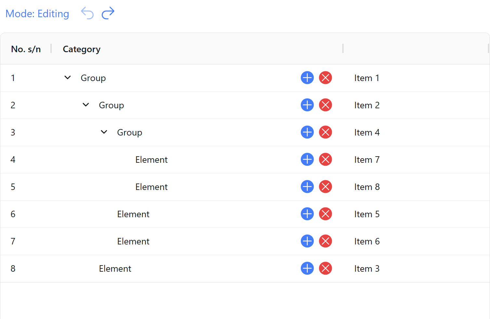

### 📋 Goal

Create a TreeStore — a TypeScript class for working with a tree of elements, and a Vue component with an AgGrid-based table for displaying and editing them.

## 🛠️ Stack / Стек

- TypeScript
- Vue 3
- ag-grid-vue
- Vite
- Vitest

---

📋 Task (in English)

### 📋 Goal

Create a TreeStore — a TypeScript class for working with a tree of elements, and a Vue component with an AgGrid-based table for displaying and editing them.

#### 🔧 TreeStore Class

Accepts an array of objects with fields: `id`, `parent`, `label`.

**Methods:**

- `getAll()` — returns all items
- `getItem(id)` — returns item by id
- `getChildren(id)` — direct children
- `getAllChildren(id)` — all descendants recursively
- `getAllParents(id)` — path from item to root
- `addItem(item)` — add an item
- `removeItem(id)` — remove item and all descendants
- `updateItem(item)` — update item data

#### 💻 Vue Component

Displays data in ag-grid-vue with two modes:

- **View** — tree of elements, rows with children can be expanded.
- **Edit** — buttons:
  - `+` to add a child
  - `×` to remove an item
  - Edit `label` directly in the table
  - Undo/redo (change history) support via arrow buttons.

#### 📦 Requirements

- TypeScript
- Minimal array traversals
- Table stability on changes (no "jumping")
- Repository with `package.json` and `package-lock.json`

#### ✅ Bonus:

- Tests for TreeStore and Vue components
- Vue components using TypeScript

📋 Задание (на русском)

### 📋 Цель

Создать TreeStore — TypeScript-класс для работы с деревом элементов и Vue-компонент с таблицей на основе AgGrid для их отображения и редактирования.

#### 🔧 Класс TreeStore

Принимает массив объектов с полями `id`, `parent`, `label`.

**Методы:**

- `getAll()` — возвращает все элементы
- `getItem(id)` — возвращает элемент по id
- `getChildren(id)` — прямые потомки
- `getAllChildren(id)` — все потомки рекурсивно
- `getAllParents(id)` — путь от элемента к корню
- `addItem(item)` — добавить элемент
- `removeItem(id)` — удалить элемент и всех потомков
- `updateItem(item)` — обновить данные элемента

#### 💻 Vue-компонент

Отображает данные в ag-grid-vue с двумя режимами:

- **Просмотр** — дерево элементов, строки с потомками раскрываются.
- **Редактирование** — кнопки:
  - `+` для добавления потомка
  - `×` для удаления элемента
  - Редактирование `label` прямо в таблице
  - Поддержка undo/redo (история изменений) через кнопки стрелок.

#### 📦 Требования

- TypeScript
- Минимальное количество обходов массива
- Стабильность таблицы при изменениях (не «прыгает»)
- Репозиторий с `package.json` и `package-lock.json`

#### ✅ Плюсом будет:

- Тесты на TreeStore и Vue-компоненты
- Компоненты на Vue с использованием TypeScript

